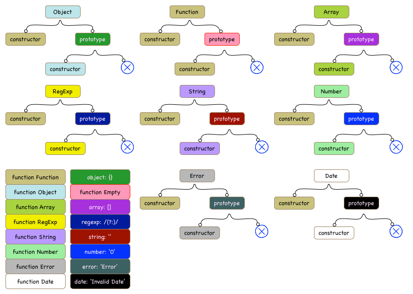
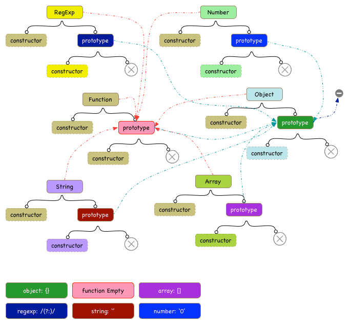
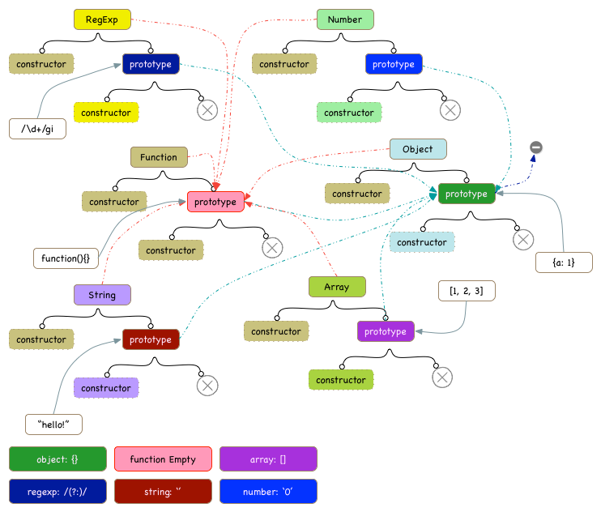
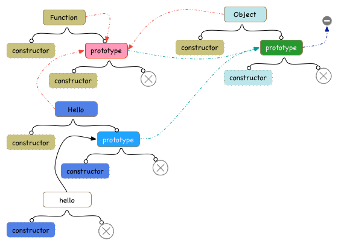
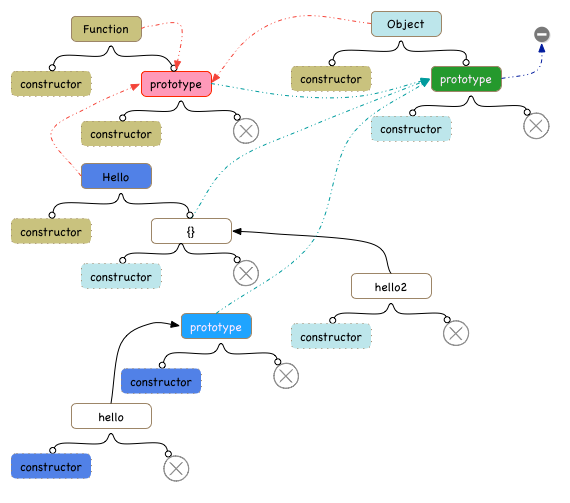
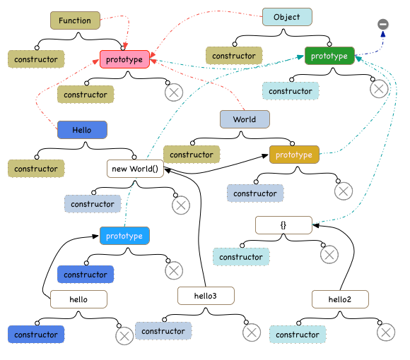
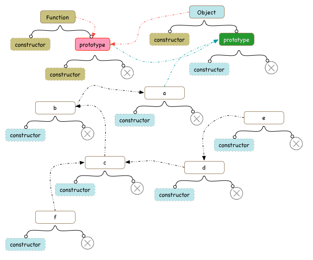

#JavaScript Object Model

##JavaScript中的内置对象

注：同背景颜色的对象为同一个对象，白色背景或无背景不受此规则限制，后面的图片规则类似。

从上图可以看到，我们一共列出了16个对象，包括Object，Function，Array，RegExp，String，Number，Error，Date及其所对应的原型对象。

对于每一个对象，都含有其constructor和prototype，如果该对象原型为**Function**，则其constructor为**Function**，对于所有非Function原型的对象，其constructor和该对象原型的constructor一致(后面我们会详细讨论这个问题)。对于**Function**原型的对象，它都会有一个独立空间表示其prototype，每个对象prototype各不相同。而对于非**Function**原型的对象，则其prototype为undefined。

其实JavaScript中的constructor概念是很蹩脚的，其实基于原型继承的语言是完全用不上这个东西的。它存在的唯一用处就是给prototype找一个宿主，从而约定一组从该原型派生出来的一组对象的行为。事实上把原型定义在对象上会更直观，也是其他原型编程语言的的普遍做法。也许有的同学就会问了，这样就没有办法区分类和对象了？确实如此，但是原型编程语言其实根本不需要有类的概念，有对象就可以了，从同一个对象原型派生出去的对象即可以把它们认为是同一个类型的对象，通过约定，我们很容易做到这一点，比如大写开头的对象我们把它当做模板或者类型来用（其实它本身依然是一个对象），小写开头的对象就是我们实际需要使用的对象。

##JavaScript内置对象的依赖关系

###内置对象的依赖关系
从上图，我们很容易可以看出如下的对象原型之间的依赖关系

* **constructor**
	* Function -> Function.prototype -> Object.prototype -> null
	* Object -> Function.prototype -> Object.prototype -> null
	* Array -> Function.prototype -> Object.prototype -> null
	* Number -> Function.prototype -> Object.prototype -> null
	* Error -> Function.prototype -> Object.prototype -> null
	* String -> Function.prototype-> Object.prototype -> null
	* Date -> Function.prototype -> Object.prototype -> null
	* RegExp -> Function.prototype -> Object.prototype -> null
* **prototype**
	* Function.prototype -> Object.prototype -> null
	* Object.prototype -> null
	* Array.prototype -> Object.prototype -> null 
	* Number.prototype -> Object.prototype -> null
	* Error.prototype -> Object.prototype -> null
	* String.prototype -> Object.prototype -> null
	* Date.prototype -> Object.prototype -> null
	* RegExp.prototype -> Object.prototype -> null

关联代码: [system.js](https://github.com/jameszhan/simplifyjs/blob/master/kernel/system.js)	
	
###自定义对象原型的依赖关系

##内存模型
~~~js

function Hello(){}
var hello = new Hello();
~~~

当执行完以上这段代码，系统中会增加3个对象，一个是Hello函数对象，一个是附属于Hello的prototype对象，还一个是hello对象。它们有如下的依赖关系

* Hello -> Function.prototype -> Object.prototype -> null
* hello -> Hello.prototype -> Object.prototype -> null

~~~js
Hello.prototype = {};
var hello2 = new Hello();
~~~
当改变constructor的prototype，对象的constructor也会相应地改变，并且对象的constructor一定等于其prototype的constructor。这里我们更新了Hello的prototype,然后派生出hello2。这个过程中，系统中增加了2个对象，{}和hello2，并且hello2的constructor就是{}的constructor，也即是Object.prototype.constructor。

值得注意的是，之前的prototype将不再和Hello相关联，也即原来的hello对象和Hello函数没有任何关系，更新Hello.prototype将不会对hello产生任何影响，我们可以通过Object.getPrototypeOf(hello)得到其prototype，值得注意的是，该prototype的constructor依然是Hello本身。

~~~js
function World(){}
Hello.prototype = new World();
var hello3 = new Hello();
~~~

这里，我们引入了新的函数World，并更新了Hello.prototype到其派生对象，然后创建了一个新实例hello3，这个过程中，系统中共增加了4个对象，分别是World, World.prototype，new World()，以及hello3。同hello一样，hello2将不再于Hello产生任何关联，整个系统中的对象将有如下的依赖关系。

* hello -> prototype(最初的Hello.prototype) -> Object.prototype -> null
* hello2 -> {} -> Object.prototype -> null
* hello3 -> new World() -> World.prototype -> Object.prototype -> null

关联代码: [constructor.js](https://github.com/jameszhan/simplifyjs/blob/master/kernel/constructor.js)	

##更好的JavaScript

###忘掉丑陋的new关键字
JavaScript的new关键字确实会使不少人感到困惑，当你熟悉原型编程以后，你会发现new这个关键字越来越蹩脚，但是由于历史原因，你又没有办法完全摆脱它，毕竟，普通对象上是没有prototype属性的，必须借助Function原型派生的对象作为其prototype宿主，而new恰恰充当了对象到其原型的桥梁作用。

下面，我们将定义一个方法，把new给隐藏起来，允许从一个普通对象直接派生出其他对象。

~~~js
Object.beget = function(o){
    var F = function(){};
    F.prototype = o;
    return new F();
};
~~~

好的，我们下一步来看看如何使用它。

~~~js
var a = {};
var b = Object.beget(a);
var c = Object.beget(b);
var d = Object.beget(c);
var e = Object.beget(d);
var f = Object.beget(c);
~~~

根据前面的知识，我们可以很容易地画出下面的内存模型图

细心的同学可能会很好奇，F函数去哪儿了呢？其实我们完全没必要关心F的存在，就拿b来说，我们很容易地知道b的构造函数等于其原型的构造函数，即a的构造函数(Object)，事实上我们已经没有办法通过JavaScript的方法去得到F的信息了，从这个层面，其实F是可以被垃圾回收掉的。

详细示例代码可以参考：[object_model.js](https://github.com/jameszhan/simplifyjs/blob/master/kernel/object_model.js)	

###代码示例
~~~
var Vehicle = {
    start: function(){
        console.log("Start " + this);
    },
    stop: function(){
        console.log("Stop " + this);
    }
}

var Car = Object.beget(Vehicle);
Car.tweet = function(){
    console.log(this + " tweet");
};

var myCar = Object.beget(Car);
Object.traceObj('myCar', myCar);
myCar.start();
myCar.tweet();
myCar.stop();
~~~

详细示例代码可以参考：[examples.js](https://github.com/jameszhan/simplifyjs/blob/master/kernel/examples.js)	